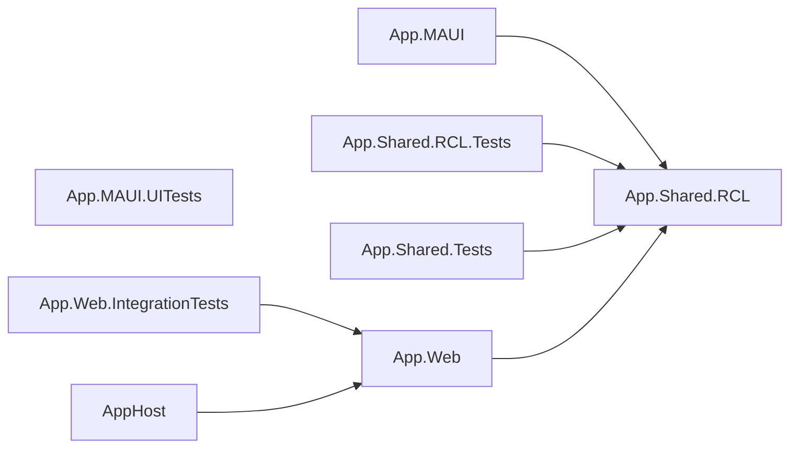
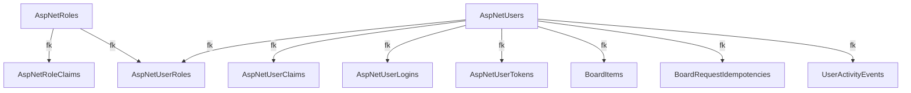

# Habitinator

<div align="center">


[](https://github.com/tothKarolyDavid/Habitinator/releases/latest)

A cross-platform productivity app built with .NET MAUI and Blazor. Manage habits, dailies, and to-dos with a focus timer, analytics, and reliable sync across web and mobile.

**Live Demo:** [habitinator.app](https://habitinator.app)

[Demo](https://habitinator.app) • [Preview](#preview) • [Download](#download--install) • [Features](#product-features-current) • [Tech Stack](#technology-stack) • [Getting Started](#run-and-debug)

</div>

---

## Preview
<div align="center">

<picture>
  <source media="(prefers-color-scheme: dark)"  srcset="docs/automation/demo-video-dark.gif">
  <source media="(prefers-color-scheme: light)" srcset="docs/automation/demo-video-light.gif">
  
</picture>

</div>

---

## Download & Install

### Available builds

**Live Demo (Web):** [https://habitinator.app](https://habitinator.app)  
**Latest Release:** [](https://github.com/tothKarolyDavid/Habitinator/releases/latest)

| Platform | Package | Notes |
|----------|---------|-------|
| Android | [Habitinator-android.apk](https://github.com/tothKarolyDavid/Habitinator/releases/latest/download/Habitinator-android.apk) | Install on-device (unknown sources required) |
| Windows | [Habitinator-windows-x64.zip](https://github.com/tothKarolyDavid/Habitinator/releases/latest/download/Habitinator-windows-x64.zip) | Portable app, extract and run |
| iOS / macOS | *Source only* | Build from source using .NET MAUI workload |

**Windows runtime note:** if your release is framework-dependent, install [.NET Desktop Runtime](https://dotnet.microsoft.com/download/dotnet/10.0) once.

#### Option 1: Use prebuilt release assets (recommended)

1. Open [latest releases](https://github.com/tothKarolyDavid/Habitinator/releases/latest)
2. Download your platform package
3. Follow platform steps below

#### Option 2: Build locally with .NET SDK

```powershell
# Windows
dotnet build -t:Run -f net10.0-windows10.0.19041.0

# Android (requires Android SDK)
dotnet build -t:Run -f net10.0-android
```

### Installation instructions

#### Android

1. Enable Install from unknown sources in system settings
2. Transfer the APK to your phone
3. Open the APK and install

#### Windows

1. Extract the ZIP file
2. Run `Habitinator.exe`
3. If prompted, install .NET Desktop Runtime

---

## What the app is for

- **One place to plan work**: recurring habits, scheduled dailies, and one-off to-dos, each with title, optional notes, tags, and (where relevant) checklists and scheduling options.
- **Time on task**: a **global** stopwatch-style timer; when you stop it, you log elapsed time to a chosen habit, daily, or to-do so it appears in your **activity history** and **statistics**.
- **Insight without games**: an **activity heatmap**, period summaries, per-day drill-down, and tag filtering are built on **UserActivity** events (completions, timer logs, etc.) stored in PostgreSQL on the server.
- **Web and native**: use the **Blazor web** app in the browser (online, server-backed), or the **.NET MAUI** Blazor Hybrid app on **Android, iOS, Mac Catalyst, or Windows** with **local-first** board data and background sync to the same API the web uses.
---

## Product features (current)

### Login, register, and seeding

- **Register**: email and password via **web pages** and **`POST /api/auth/register`**; HTML forms use **`/api/auth/register-form`** and redirect after success.
- **Log in**: **web** uses **cookie** sign-in (`/api/auth/cookie-login`); **MAUI** uses **`POST /api/auth/login`** and sends the returned **JWT** on API calls. **Log out** via cookie or JSON logout as appropriate.
- **Demo / guest**: **`/api/auth/guest-login`** (browser, sets cookie) or **`/api/auth/guest-jwt`** (returns JWT for native clients).
- **Seeding** (after migrations at startup): the **guest** user from **`DemoUser`** in configuration is **created if missing**; if that user has **no board items**, **sample habits, dailies, and to-dos** are inserted, and **sample activity** may be generated for **Statistics**. Re-runs do not duplicate existing data.

### Board layout and finding items

- **Three sections** with the same mental model as Habitica: Habits, Dailies, To-Dos.
- **Layout**: on large screens, **three columns**; on small screens, **tabs** for each section.
- **Summary chips** (counts for habits, dailies still due, open to-dos).
- **Search**: a **search** box filters items by **title** (and related visible text) so long boards stay manageable.
- **Tag filtering**: items carry **tags** (set in the **edit** modals). A **tag** menu on the board restricts the list to matching items; **Statistics** can use the same tag filter for the heatmap and aggregates.

### Edit modals (add and full edit)

- **New item**: a **title** dialog creates a Habit, Daily, or To-Do; each type opens a dedicated **edit** modal for the rest of the fields.
- **Habit**: **title**, **notes**, **tags**, **+ / −** visibility, **sub-checklist**, **reset period** for counters, manual counter values.
- **Daily**: **title**, **notes**, **tags**, **start date** (UTC calendar), **repeat** pattern and **interval**, **streak** fields, **sub-checklist**, completion aligned with the schedule.
- **To-do**: **title**, **notes**, **tags**, optional **due date**, **sub-checklist**, completion.
- **Shared UI**: the same **Razor Class Library** components run in **Blazor Server** and in the **MAUI WebView**.

### Dailies: repeating periods

- Repeats are **daily** (with an **interval**, e.g. every 2 days), **weekly**, **monthly**, or **yearly**, anchored by a **start date**. Streaks and “due on” logic follow this model. The **yesterday catch-up** dialog (below) lists dailies that were **due yesterday (UTC)** but still incomplete for that date.

### Sub-checklists

- **Habits, dailies, and to-dos** can each include a **checklist** of smaller steps (independent checkboxes). Checklist JSON is stored on the item and **syncs** through the board API (and **SQLite** outbox on MAUI).

### First board load each UTC day: “Catch up: yesterday’s dailies”

- After the board loads, the app may open a modal (**“Catch up: yesterday’s dailies”**) if there are **incomplete dailies** whose **due date was yesterday (UTC)**. You can **mark done** for that date from the dialog.
- The prompt is shown **at most once per UTC day** per browser session (with **local storage** so returning the same day does not repeat it). If there is nothing to catch up, **no** dialog appears.

### Board actions, loading, and offline

- **Habits**: **+** / **−** when enabled; **edit** for full fields.
- **Dailies** / **To-dos**: **complete** toggles and **edit** modals; dailies support **complete for a specific date** via the API where applicable.
- **Errors**: **Retry** if the board snapshot fails to load.
- **MAUI**: **offline**, **syncing**, **last synced**, and **sync error** messages when the local-first pipeline is active.

### Timer and “Time’s up after”

- **Session timer** (one global clock for the app): **start**, **pause**, **resume**, **stop**; elapsed time is shown as **hh:mm:ss**.
- **Session target** (autocomplete): pick a **Habit, Daily, or To-Do** (or a custom label). On **Stop & log**, elapsed time is recorded as **activity** for that target, which feeds **Statistics** and server **UserActivity** on web.
- **“Time’s up after”** (optional): a **focus duration** in flexible text forms (e.g. `25` minutes, `1:20`, `90s`, `0:0:30`). While the timer **runs**, reaching that duration **pauses** the clock and triggers **in-app** and (where enabled) **device** alerts—see **Settings** for **focus timer** end alerts, **quiet hours**, and sound. Leave the field empty for a **plain stopwatch** with no automatic “time’s up” behavior.

### Statistics and activity

- **Statistics** page: **activity heatmap** (click a day for detail), **period** selection aligned with how your dailies define “calendar” periods where applicable, and optional **tag** filter to narrow events to items that carry that tag.
- **Per-day detail** dialog: list of **logged events** for a chosen day (completions, timer duration, etc.) with links back to item titles when available.
- **Dashboard / daily contributions** data is exposed from the **Activity API** (used by the statistics reader implementation).

### Notifications and settings

- **User notification settings** (stored per user, JSON in the database) control:
  - In-app toasts and **severity** (success / warning / error) and **duration**
  - **Focus timer** end alerts (respecting quiet hours where applicable)
  - **Daily reminder** (enable + time of day)
  - **Sync failure** alerts (relevant for MAUI)
  - **Device notification** sound preference where local notifications are used
  - **Quiet hours** (UTC window) to suppress noisy notifications at night
- Changing settings can **notify** connected clients (via the board change pipeline) so preferences stay coherent.

### Authentication and accounts (technical)

- User store is **ASP.NET Core Identity** (see [Login, register, and seeding](#login-register-and-seeding) for UX). **Board / activity / settings** APIs require the **`BoardOrJwt`** policy: **cookie** (interactive web) or **`Authorization: Bearer`** (MAUI / JSON clients).
- Default **demo guest** credentials and seeding behavior: [Demo guest user](#demo-guest-user).

### Real-time and sync

- **SignalR** hub at `/hubs/board` notifies the current user’s group when the board (or related settings) should refresh; the **web** Blazor app reconnects and reloads; **MAUI** uses the .NET **SignalR client** and then refreshes from local SQLite / server as implemented.
- **Web** is **online-only**: the board is read and written through `WebBoardDataService` directly against PostgreSQL in the same process.
- **MAUI** is **local-first**: SQLite mirror, **outbox** of mutations, **sync coordinator** with retries, **incremental sync** when a cursor is known, and **idempotency** + **optimistic concurrency** on the API (see [Cross-platform sync](#cross-platform-sync-and-local-first-behavior) below).

### Demo and developer experience

- **Aspire AppHost** starts PostgreSQL (with **pgAdmin** and a data volume in the default template), the **web** project (e.g. port **5031**), and optionally the **MAUI** project with the API base URL **injected** for device/emulator use.
- **Health endpoint**: `GET /health` (plain `OK`) for orchestration and CI. It does **not** open PostgreSQL; the process can be “healthy” while the database is down (liveness only).
- **Seeded guest** account and **demo board / activity** data when appropriate so you can explore without manual setup.

---

## Technology stack

| Area | Technology |
|------|------------|
| Runtime | **.NET 10** |
| Web UI | **Blazor Web App** with **Interactive Server** components, **MudBlazor** |
| Mobile / desktop shell | **.NET MAUI** + **BlazorWebView** (Android, iOS, Mac Catalyst, Windows) |
| Shared UI | **Razor Class Library** (`App.Shared.RCL`) consumed by **App.Web** and **App.MAUI** |
| API host | **ASP.NET Core** minimal APIs, **SignalR** |
| Auth | **ASP.NET Core Identity**, **cookie** + **JWT Bearer** (`Microsoft.AspNetCore.Authentication.JwtBearer`) |
| Server database | **Neon serverless PostgreSQL** (or any Postgres) via **EF Core** + **Npgsql** |
| Server Postgres resilience (`App.Web`) | **Connection timeout** floor (15s), **EF `EnableRetryOnFailure`**, **Polly** around startup migrations (see [Server PostgreSQL resilience](#server-postgresql-resilience-appweb)) |
| MAUI local store | **SQLite** + **EF Core Sqlite** for mirrored board and sync metadata |
| Orchestration (local) | **.NET Aspire** AppHost (e.g. **Aspire.Hosting.Postgres**, **13.x**), PostgreSQL **17.6** image, **pgAdmin** in the default AppHost project |
| HTTP resilience (MAUI) | **Microsoft.Extensions.Http.Resilience** on the API `HttpClient` only (timeouts, transient retries)—**not** the same layer as server-side Postgres retries in `App.Web` |
| Local notifications (MAUI) | **Plugin.LocalNotification** |
| Test data (server) | **Bogus** (guest activity demo seeding, etc.) |
| Unit / component tests | **xUnit**, **bUnit** (RCL smoke tests) |
| Integration tests | **WebApplicationFactory**, **Testcontainers** (Docker) for PostgreSQL |
| Browser E2E | **Playwright** |
| Android UI (opt-in) | **Appium** + **UiAutomator2** |

---

## Solution structure

- **`src/AppHost`** — Aspire orchestration: PostgreSQL, database `habitinatordb`, `app-web` (HTTP launch profile, port **5031**, endpoint **not** proxied so **Blazor + SignalR WebSockets** work with Kestrel), **`app-maui`** with `HABITINATOR_API_BASE_URL` set to the web app’s HTTP endpoint, **WaitFor** database and web.
- **`src/App.Web`** — Blazor app, minimal APIs, Identity, EF Core, SignalR `BoardHub`, health check, static assets, hosted board maintenance.
- **`src/App.MAUI`** — MAUI Blazor host, SQLite, outbox sync, SignalR client, resilient `HttpClient`, local notifications.
- **`src/App.Shared.RCL`** — Shared Razor components (board, columns, timer, statistics, settings, dialogs), models, and services (board abstractions, activity stats calculator, timer, notifier).
- **`tests/App.Shared.Tests`** — Unit tests for shared logic.
- **`tests/App.Shared.RCL.Tests`** — bUnit component tests.
- **`tests/App.Web.IntegrationTests`** — API + PostgreSQL (Docker / Testcontainers).
- **`tests/App.Web.E2E`** — Playwright (requires running `App.Web`, `E2E_BASE_URL`).
- **`tests/App.MAUI.UITests`** — Android UI (opt-in via `ANDROID_UI_TESTS`).

---

## Cross-platform sync and local-first behavior

- **PostgreSQL** is the **source of truth** for synchronized user data.
- **Web (`App.Web`)** is **online-only**: the board is read and written through `WebBoardDataService` against PostgreSQL directly (no local caching or outbox).
- **MAUI (`App.MAUI`)** is **local-first** for the productivity board:
  - Board data is mirrored in **SQLite** on the device.
  - Edits apply locally and append to an **outbox** for the REST board API under `/api/board`.
  - A background **sync coordinator** drains the outbox when online (exponential backoff on failures), then **pulls** incremental changes (`GET /api/board/sync?cursor=`) when a cursor is stored, otherwise a **full snapshot** (`GET /api/board`).
  - **SignalR** can still prompt a refresh; the refresh path pulls into SQLite before the Blazor UI reloads.
  - **Signing out** clears the local mirror and outbox for that device.
- **Board API reliability** (what native clients and tests assume):
  - **`Idempotency-Key`**: optional on web; **MAUI** sends it from the outbox `OperationId`. Duplicate same key + same request **fingerprint** replays the stored result; same key with a **different** body returns **409** with `problem: idempotency_key_reuse`.
  - **Optimistic concurrency**: **`X-Board-Expected-Updated-At-Utc`** or **`If-Match`** (item `ServerUpdatedAtUtc`, ISO-8601). Mismatch returns **409** with `problem: version_conflict` and current `item` JSON. **MAUI** policy: drop conflicting outbox op and **resync** (server wins).
  - **Incremental sync**: `GET /api/board/sync?cursor=` returns upserts, **`deletedItemIds`**, **`nextCursor`**. Invalid cursors: **400**; MAUI clears cursor and does a full snapshot.
  - **HTTP resilience**: MAUI’s API `HttpClient` uses **Microsoft.Extensions.Http.Resilience** (timeouts + transient retries for **HTTP**). **Server-side** PostgreSQL retries live in **`App.Web`** (EF Core + Polly around migrations); do not confuse the two layers. **401** still clears the session as implemented.
  - **Maintenance**: a hosted service purges old idempotency rows and prunes old tombstones per configuration.

**MAUI base URL** — configure `Api:BaseUrl`, **`HABITINATOR_API_BASE_URL`**, or `MauiAppSettings` (see [Run and debug](#run-and-debug)). When you start from **AppHost**, the MAUI process receives the web URL automatically.

---

## Aspire and PostgreSQL

- **AppHost** provisions:
  - PostgreSQL (parameters for user/password, **Postgres 17.6** image, optional **data volume**)
  - Database resource **`habitinatordb`**
  - **`app-web`**: project reference, **WaitFor** database, **HTTP health** on `/health`
- **`App.Web`** accepts:
  - `ConnectionStrings:habitinatordb` (from Aspire), or
  - `ConnectionStrings:DefaultConnection` (standalone with your own PostgreSQL)

**Local vs hosted:** Aspire and the repo badges describe **PostgreSQL 17.x** for **local** Docker/Aspire runs. **Azure** (and similar) deployments usually point `ConnectionStrings` / `POSTGRES_CONNECTION_STRING` at **Neon** or another managed Postgres host.

### Server PostgreSQL resilience (`App.Web`)

The web app tolerates transient Postgres failures (Neon compute restarts, scale-to-zero cold starts, pooler quirks). Implementation lives under `src/App.Web/Services/` (`PostgresResilienceConnectionString`, `PostgresDbContextOptions`, `PostgresPollyRetry`, `PostgresTransientErrors`, `PostgresMigrationConnectionStrings`).

- **Connection timeout:** `PostgresResilienceConnectionString` raises Npgsql `Timeout` to at least **15 seconds** when the configured value is lower. The sample [`src/App.Web/appsettings.json`](src/App.Web/appsettings.json) includes `Timeout=15`.
- **EF Core retries:** `EnableRetryOnFailure` (5 retries, max delay 16 seconds, extra SQLSTATE codes `57P01`, `08006`, `08003`) is applied to the main `DbContext` and `IDbContextFactory` via `PostgresDbContextOptions.UseNpgsqlWithResilience` in [`Program.cs`](src/App.Web/Program.cs).
- **Migrations:** `MigrateAsync` runs inside **Polly** (exponential backoff, jitter, same caps) with a **fresh `DbContext` per attempt**; the migration `DbContext` also registers the same EF execution strategy so individual migration commands can retry. Polly uses `PostgresTransientErrors` (SQLSTATE + Neon-style message matching). [`DemoDataSeeder`](src/App.Web/Services/DemoDataSeeder.cs) passes an `ILogger` so each Polly retry is logged at **Warning**.
- **Neon pooler vs direct:** when the primary connection string uses Neon’s `-pooler` hostname, migrations prefer a **direct** compute hostname when it can be derived safely; set `ConnectionStrings:MigrationConnection` to override (`PostgresMigrationConnectionStrings`).
- **EF vs Polly transient matching:** EF’s strategy uses Npgsql/EF transience plus the added SQLSTATE list; **Polly** uses the explicit `PostgresTransientErrors` rules (including message substrings). That split is intentional.
- **Idempotency:** EF migrations are safe to retry thanks to `__EFMigrationsHistory`. For **board writes**, use the existing idempotency and concurrency rules in [Cross-platform sync](#cross-platform-sync-and-local-first-behavior).

**Validating resilience:** in Neon, trigger a **compute restart** (or suspend/resume) while the app is running; database operations should recover without restarting the web process.

**Tests:** [`tests/App.Web.IntegrationTests/PostgresResilienceTests.cs`](tests/App.Web.IntegrationTests/PostgresResilienceTests.cs) exercises connection-string enrichment, transient detection, and Polly retries.

| README / stack note | Detail |
|---------------------|--------|
| Technology stack | **Polly** is an `App.Web` dependency for migration retries; **Microsoft.Extensions.Http.Resilience** in the table applies to **MAUI HTTP** only. |
| `GET /health` | Liveness only—does **not** probe PostgreSQL. |
| Postgres 17.6 + Aspire | Typical **local** dev; **production** connection strings often target **Neon** (see [Deployment and releases](#deployment-and-releases-azure--github)). |

---

## Run and debug

### Recommended: run via Aspire

```powershell
dotnet build Habitinator.slnx
dotnet test Habitinator.slnx
dotnet run --project src/AppHost/AppHost.csproj
```

This starts **PostgreSQL**, **App.Web** (Kestrel on the HTTP launch profile, e.g. port **5031** per `launchSettings.json`), and **App.MAUI** with the API URL pre-set—useful for emulator/device against your machine’s IP or `10.0.2.2` (Android) as appropriate.

### Visual Studio

- Set **`AppHost`** as startup to bring up Postgres + web (and MAUI if included).
- If **`App.Web`** is the only startup project, run **PostgreSQL** on `127.0.0.1:5432` (or match your connection string) yourself.

### Standalone web (without Aspire)

```powershell
dotnet run --project src/App.Web/App.Web.csproj
```

### MAUI only

Point the client at a running `App.Web` using **`HABITINATOR_API_BASE_URL`** or **`Api:BaseUrl`** in `appsettings.json` (embedded in the MAUI project).

---

## Demo guest user

Seeded at startup (if missing):

- **Email:** `guest@habitinator.local`  
- **Password:** `Guest123!`  

- **Browser demo:** `POST /api/auth/guest-login` (cookie; redirects home).  
- **API / MAUI demo:** `POST /api/auth/guest-jwt` (returns a JWT; guest user must exist).  

**Behavior:** migrations at startup, guest user created if missing, **demo board** (and **sample activity** for stats) if none exist for that user.

> Configure credentials under **`DemoUser`** in `appsettings.json` (overridable in production via configuration).

---

## API surface (current)

### Auth

| Method & path | Notes |
|---------------|--------|
| `POST /api/auth/register` | JSON body; valid email; creates user. |
| `POST /api/auth/login` | JSON; returns `LoginResponse` with **JWT** and email. |
| `POST /api/auth/guest-jwt` | Demo guest; returns JWT for MAUI/clients. |
| `POST /api/auth/logout` | **Authorized**; signs out (cookie). |
| `POST /api/auth/guest-login` | Form-style guest sign-in; **redirect**. |
| `POST /api/auth/cookie-login` | Form email/password/remember; **redirect**. |
| `POST /api/auth/cookie-logout` | **Authorized**; **redirect**. |
| `POST /api/auth/register-form` | Form register; **redirect** to login on success. |

All board/settings/activity routes use the **`BoardOrJwt`** policy: **cookie (web)** or **Bearer (API/MAUI)**.

### Board

| Method & path | Purpose |
|---------------|--------|
| `GET /api/board` | Full snapshot. |
| `GET /api/board/sync?cursor=` | Incremental sync (**cursor** required, ISO-8601). |
| `POST /api/board/{section}` | Create item (`Habit` / `Daily` / `Todo`); `ItemTitleRequest`. |
| `PUT /api/board/{section}/{itemId}` | Rename (title) for simple path. |
| `DELETE /api/board/{section}/{itemId}` | Soft-delete. |
| `POST /api/board/{section}/{itemId}/toggle` | Toggle completion (Dailies/To-dos as applicable). |
| `POST /api/board/habits/{itemId}/increment` | Habit **+** |
| `POST /api/board/habits/{itemId}/decrement` | Habit **−** |
| `PUT /api/board/habits/{itemId}` | Full habit update (`HabitUpdateRequest`). |
| `PUT /api/board/todos/{itemId}` | Full to-do update (`TodoUpdateRequest`). |
| `PUT /api/board/dailies/{itemId}` | Full daily update (`DailyUpdateRequest`). |
| `POST /api/board/dailies/{itemId}/complete-for-date` | Complete for a specific date (`DailyCompleteForDateRequest`). |

Mutations support **`Idempotency-Key`**, and **`X-Board-Expected-Updated-At-Utc` / `If-Match`** for concurrency (see above).

### Activity

| Method & path | Purpose |
|---------------|--------|
| `GET /api/activity/dashboard?period=&tag=` | Dashboard aggregates for the statistics UI. |
| `GET /api/activity/daily-contributions?period=&tag=` | Per-day series for heatmap / contributions. |
| `GET /api/activity/day?date=&tag=` | Single-day detail. |

### Settings

| Method & path | Purpose |
|---------------|--------|
| `GET /api/settings/notifications` | Get `NotificationSettings` JSON. |
| `PUT /api/settings/notifications` | Save; triggers board-related notification to refresh clients. |

### Real-time

- **SignalR:** `BoardHub` at `/hubs/board` — server pushes **`BoardChanged`** to the user’s group after relevant mutations and settings updates.

---

## Configuration

Main file: **`src/App.Web/appsettings.json`**

Important sections:

- **`ConnectionStrings`** — PostgreSQL (`DefaultConnection` / `habitinatordb`, optional `MigrationConnection` for Neon migrations); see [Server PostgreSQL resilience](#server-postgresql-resilience-appweb)
- **`Jwt`** — signing key and token lifetime (JWT for MAUI / API)
- **`DemoUser`** — email/password for the seeded guest
- **`BoardMaintenanceOptions`** (or related) — idempotency / tombstone retention (if present)

MAUI: **`src/App.MAUI/appsettings.json`** — **`Api:BaseUrl`**; environment **`HABITINATOR_API_BASE_URL`** overrides when set.

---

## Deployment and releases (Azure + GitHub)

For cloud setup and deployment, use **Azure Developer CLI**:

- **`azure.yaml`** — azd project definition (`web` service -> `src/App.Web`)
- **`infra/main.bicep`** + **`infra/main.parameters.json`** — low-cost Azure infrastructure defaults
- **`deploy-azure-web.yml`** — GitHub Actions deploy using **`azd`**
- **`release-clients.yml`** — MAUI Android/Windows release artifacts on tags

Aspire is still recommended for **local development orchestration** (PostgreSQL + web + MAUI), while Azure hosting runs only `App.Web` + PostgreSQL for lower recurring cost.

### Low-cost defaults in infra

- App Service Plan SKU: **`B1`**
- Database: **Neon serverless PostgreSQL** (external to Azure, configured via connection string)

These are demo-oriented defaults.

### One-time azd local setup

1. Create a free PostgreSQL database at [neon.tech](https://neon.tech) and copy your connection string.
2. Configure azd:

```powershell
azd auth login
azd env new demo
azd env set AZURE_LOCATION polandcentral
azd env set POSTGRES_CONNECTION_STRING "<your-neon-connection-string>"
azd env set JWT_SIGNING_KEY "<long-random-secret>"
azd env set DEMO_USER_EMAIL "guest@habitinator.local"
azd env set DEMO_USER_PASSWORD "<demo-password>"
azd up
```

### Required GitHub variables (deploy workflow)

- **`AZURE_ENV_NAME`** — azd environment name (for example: `demo` or `prod`)
- **`AZURE_LOCATION`** — Azure region
- **`AZURE_RESOURCE_GROUP`** — resource group that holds the App Service (explicit pin; avoids relying only on `rg-<AZURE_ENV_NAME>`)
- **`AZURE_SUBSCRIPTION_ID`** — subscription the pipelines should use (deterministic `az account set`)
- **`AZURE_TENANT_ID`** — Microsoft Entra tenant ID (required when using OIDC below)
- **`DEMO_USER_EMAIL`** (optional; falls back to default in workflow)

`Jwt__Issuer` is set automatically in Azure to match the deployed App Service URL (`https://<webapp-name>.azurewebsites.net`). For local tooling you can read the URL with `azd env get-value AZURE_WEBAPP_URL`.

### Azure authentication in GitHub Actions (recommended: OIDC)

Long-lived **`AZURE_CREDENTIALS`** JSON works but rotating client secrets and storing them in GitHub is weaker than **OpenID Connect (workload identity federation)**.

**Recommended setup:**

1. In Microsoft Entra ID, create an **App registration** (single tenant is typical for one subscription).
2. Add a **Federated credential** for GitHub:
   - **Issuer:** `https://token.actions.githubusercontent.com`
   - **Subject:** `repo:<YOUR_GITHUB_ORG_OR_USER>/<REPO_NAME>:environment:production` so workflows that use the GitHub **[environment](https://docs.github.com/en/actions/deployment/targeting-different-environments/using-environments-for-deployment)** named **`production`** (both **Deploy Web app to Azure** and **Release MAUI clients** discovery) receive OIDC tokens Azure accepts.
3. Grant the app **least privilege** on Azure, for example **Contributor** on the resource group scope only:  
   `/subscriptions/<SUBSCRIPTION_ID>/resourceGroups/<AZURE_RESOURCE_GROUP>`
4. Set these **repository variables** (IDs are not secrets; they still identify your tenant and subscription):
   - **`AZURE_CLIENT_ID`** — application (client) ID of the app registration
   - **`AZURE_TENANT_ID`** — directory (tenant) ID
   - **`AZURE_SUBSCRIPTION_ID`** — subscription ID

The workflows use the composite action **`.github/actions/azure-login`**: if **`AZURE_CLIENT_ID`** is set, they log in with OIDC; otherwise they fall back to the legacy secret below.

Official overview: [Use GitHub Actions to connect to Azure](https://learn.microsoft.com/azure/developer/github/connect-from-azure).

### Required GitHub secrets (deploy workflow)

- **`AZURE_CREDENTIALS`** (optional if OIDC variables above are set) — service principal JSON from `az ad sp create-for-rbac --sdk-auth` or equivalent; remove after migrating to OIDC
- **`POSTGRES_CONNECTION_STRING`**
- **`JWT_SIGNING_KEY`**
- **`DEMO_USER_PASSWORD`**

### Required GitHub variables/secrets (MAUI release workflow)

**Production URL (pick one approach):**

- **Automatic (recommended):** leave **`PRODUCTION_API_BASE_URL`** empty. The release workflow signs into Azure (OIDC if **`AZURE_CLIENT_ID`** is set, otherwise **`AZURE_CREDENTIALS`**), finds the `web` App Service tagged like **`infra/main.bicep`** (`azd-service-name=web`, `azd-env-name=<AZURE_ENV_NAME>`), and uses its default hostname. Use the same **`AZURE_ENV_NAME`**, **`AZURE_RESOURCE_GROUP`**, and **`AZURE_SUBSCRIPTION_ID`** as the deploy workflow when discovering resources.
- **Manual override:** set **`PRODUCTION_API_BASE_URL`** and optionally **`PRODUCTION_WEB_URL`** when you want the clients pinned to a specific URL regardless of Azure.

Signing (only if you add signing steps later): **`ANDROID_KEYSTORE_BASE64`**, **`ANDROID_SIGNING_KEY_ALIAS`**, **`ANDROID_SIGNING_STORE_PASS`**, **`ANDROID_SIGNING_KEY_PASS`**.

### Release process

1. Deploy/update backend (`azd up` locally or deploy workflow).
2. Push a tag like **`v1.2.0`**.
3. The workflow resolves the API base URL (from Azure or from **`PRODUCTION_API_BASE_URL`**), builds MAUI Android + Windows artifacts, and publishes a GitHub release with checksums and the hosted web URL in the notes.

---

## Documentation automation (local)

Committed assets for architecture and UI references live under **`docs/automation/`**:

| Output | Description |
|--------|-------------|
| [`docs/automation/solution-graph.mmd`](docs/automation/solution-graph.mmd) | Mermaid **flowchart** of project references (from `Habitinator.slnx` + `.csproj` files). |
| [`docs/automation/database-schema.mmd`](docs/automation/database-schema.mmd) | Mermaid **flowchart** of EF Core FKs / PostgreSQL tables (from the latest `ApplicationDbContextModelSnapshot`). |
| [`docs/automation/openapi-v1.json`](docs/automation/openapi-v1.json) | OpenAPI **3.1** document from `GET /openapi/v1.json` (paths and schemas for HTTP APIs). |
| [`docs/automation/screenshots/`](docs/automation/screenshots/) | Playwright **PNG** captures in **light and dark** (`*-light.png` / `*-dark.png`): board, modals, statistics, settings, auth pages, etc. |
| [`docs/automation/demo-video-light.mp4`](docs/automation/demo-video-light.mp4) / [`demo-video-dark.mp4`](docs/automation/demo-video-dark.mp4) | Playwright **MP4** video walkthrough recordings of the app in **light and dark** theme (transcoded from WebM for cross-browser compatibility). |

### Architecture diagrams (Mermaid)

GitHub renders **`mermaid`** fenced blocks below. After **`tools/Habitinator.Diagrams`** writes `docs/automation/*.mmd`, **`scripts/Refresh-AutomationAssets.ps1`** copies that content into this README (between the HTML markers). The `.mmd` files remain the canonical copies for diffs and other tools.

**Solution — project reference graph**

<!-- HABITINATOR_MERMAID_BEGIN:solution-graph -->

<!-- HABITINATOR_MERMAID_END:solution-graph -->

**Database — EF Core relationships (PostgreSQL tables)**

<!-- HABITINATOR_MERMAID_BEGIN:database-schema -->

<!-- HABITINATOR_MERMAID_END:database-schema -->

**Web UI gallery:** see [Preview](#preview) near the top of this file for the demo videos.

**Regenerate local automation assets (diagrams, OpenAPI, Playwright):** start **`App.Web`** with PostgreSQL (e.g. standalone or Aspire), using the same **URL** you pass as `-BaseUrl` (default `http://127.0.0.1:5050`). Then run:

```powershell
pwsh ./scripts/Refresh-AutomationAssets.ps1
# If the app uses another URL (e.g. Aspire http profile on 5031):
pwsh ./scripts/Refresh-AutomationAssets.ps1 -BaseUrl "http://127.0.0.1:5031"
```

The script writes into `docs/automation/`, **syncs the Mermaid blocks in `README.md`** from the generated `.mmd` files, installs Chromium for Playwright if needed, and runs the documentation screenshot test.

**Regenerate demo videos:** start **`App.Web`** and run:

```powershell
pwsh ./scripts/Record-DemoVideo.ps1
# If the app uses another URL (e.g. Aspire http profile on 5031):
pwsh ./scripts/Record-DemoVideo.ps1 -BaseUrl "http://127.0.0.1:5031"
```

Review diffs, then commit.

The **`servers`** entry inside `openapi-v1.json` reflects the base URL used when the file was exported; it does not affect how the app runs.

---

## Testing and quality

- **Build:** `dotnet build Habitinator.slnx`
- **All automated tests (solution):** `dotnet test Habitinator.slnx`  
  - **Integration** tests need **Docker** (Testcontainers).  
  - **MAUI Android UI** tests are **skipped** unless `ANDROID_UI_TESTS=1` (or Windows `$env:ANDROID_UI_TESTS='1'`).
- **TRX (local / IDE):**  
  `dotnet test Habitinator.slnx --results-directory ./TestResults --logger trx`
- **VS Code tasks:** run **Test: Solution** from the command palette.
- **Playwright E2E** (project `tests/App.Web.E2E`; not part of `Habitinator.slnx`):
  1. Start PostgreSQL and `App.Web` (e.g. `http://127.0.0.1:5050`).  
  2. Install browsers once: `pwsh tests/App.Web.E2E/bin/Debug/net10.0/playwright.ps1 install chromium` (path matches your configuration).  
  3. `dotnet test tests/App.Web.E2E/App.Web.E2E.csproj` (defaults to `E2E_BASE_URL=http://127.0.0.1:5050` if unset).
- **Android UI (Appium)** — build APK, emulator/device, **Appium 2** + **UiAutomator2**, then opt-in `dotnet test` with `ANDROID_UI_TESTS`; optional `ANDROID_APP_PATH`, `APPIUM_SERVER_URL`. Optional workflow: [`.github/workflows/android-uitest.yml`](.github/workflows/android-uitest.yml) (`workflow_dispatch`).
- **CI:** [`.github/workflows/ci.yml`](.github/workflows/ci.yml) — **`dotnet build`** and **`dotnet test`** (TRX to **Test results** in GitHub Checks; TRX files also uploaded as a workflow artifact). No Playwright or committed-asset generation in CI.

---

## Roadmap and limitations

- The domain is **rich enough** for real use (tags, checklists, schedules, activity events) but can grow further: full **recurrence** persistence edge cases, deeper **streak** analytics, more **bUnit** coverage for MudBlazor + JS interop, broader **E2E** and **device matrix**, and any additional **push** or **Background Tasks** for sync on mobile OSes.

For detailed **sync contract** and **troubleshooting** client behavior, treat the [Cross-platform sync](#cross-platform-sync-and-local-first-behavior) section above and the **integration tests** in `App.Web.IntegrationTests` as the contract tests for the server.
