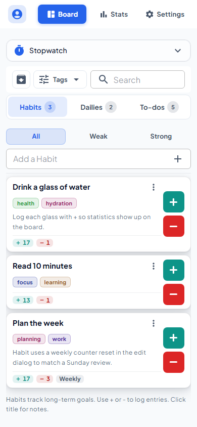
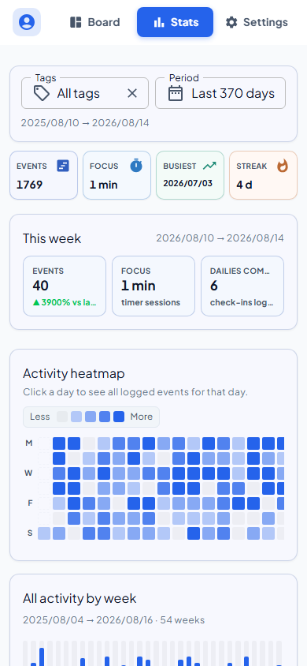
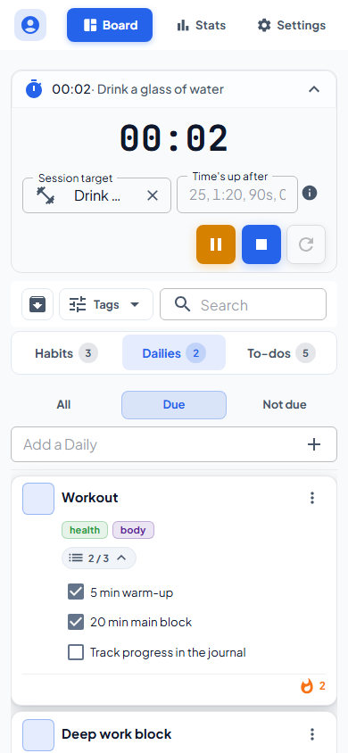
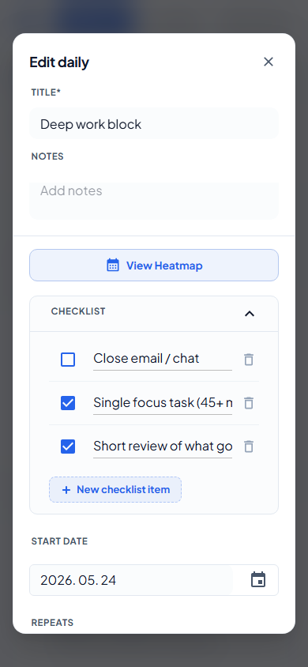
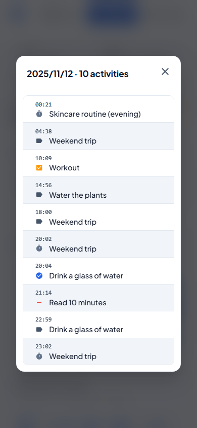
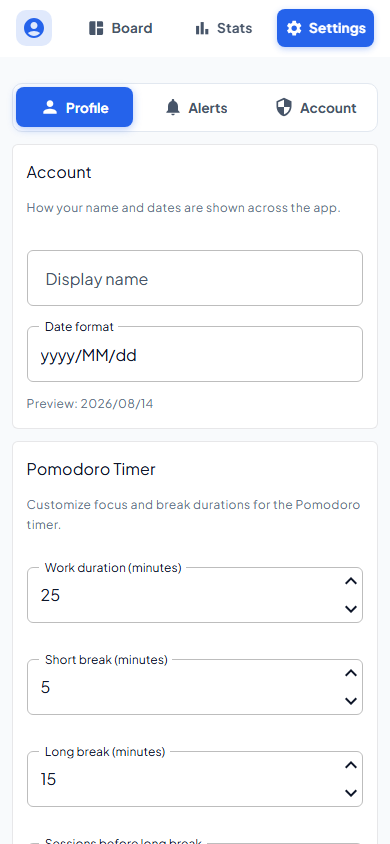
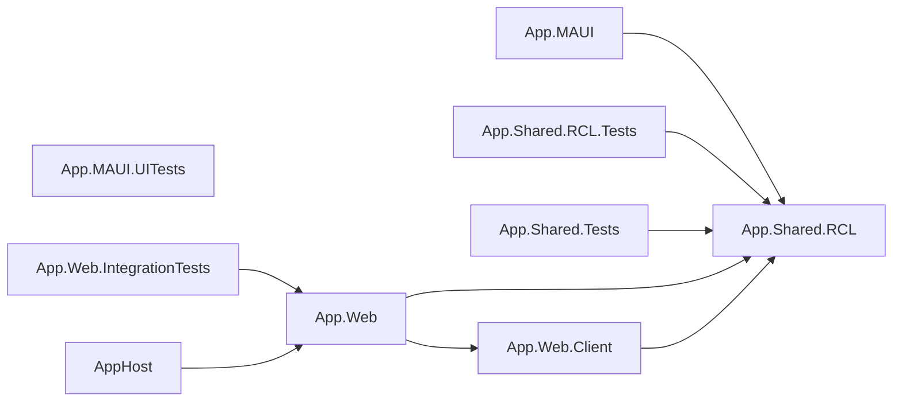

# Habitinator

<div align="center">


[](https://github.com/tothKarolyDavid/Habitinator/releases/latest)

A cross-platform productivity app built with .NET MAUI and Blazor. Manage habits, dailies, and to-dos with a focus timer, analytics, and reliable sync across web and mobile.

**Live Demo:** [habitinator.app](https://habitinator.app)

[Demo](https://habitinator.app) | [Preview](#preview) | [Download](#download-and-install) | [Features](#key-features) | [Tech stack](#technology-stack) | [Getting Started](#getting-started)

</div>

---

## Preview

<div align="center">

<p align="center">
<strong>Board</strong> | <strong>Statistics</strong> | <strong>Focus timer</strong><br><br>
<picture>
  <source media="(prefers-color-scheme: dark)" srcset="./docs/automation/screenshots/board-dark.png">
  
</picture>
&nbsp;&nbsp;
<picture>
  <source media="(prefers-color-scheme: dark)" srcset="./docs/automation/screenshots/statistics-dark.png">
  
</picture>
&nbsp;&nbsp;
<picture>
  <source media="(prefers-color-scheme: dark)" srcset="./docs/automation/screenshots/timer-dark.png">
  
</picture>
</p>

<br>

<p align="center">
<strong>Edit daily</strong> | <strong>Activity day detail</strong> | <strong>Settings</strong><br><br>
<picture>
  <source media="(prefers-color-scheme: dark)" srcset="./docs/automation/screenshots/edit-daily-dark.png">
  
</picture>
&nbsp;&nbsp;
<picture>
  <source media="(prefers-color-scheme: dark)" srcset="./docs/automation/screenshots/activity-day-detail-dark.png">
  
</picture>
&nbsp;&nbsp;
<picture>
  <source media="(prefers-color-scheme: dark)" srcset="./docs/automation/screenshots/settings-dark.png">
  
</picture>
</p>

</div>

> Screenshots are regenerated with `tools/Habitinator.Screenshots/run.ps1`. It uses Playwright with a mobile viewport in light and dark themes.

---

## Download and install

Download the latest build from the [releases page](https://github.com/tothKarolyDavid/Habitinator/releases/latest), or use the direct links below. Every package ships with a SHA256 checksum file.

| Platform | Package | Size | Notes |
|----------|---------|------|-------|
| Android | [](https://github.com/tothKarolyDavid/Habitinator/releases/latest/download/Habitinator-android.apk) | 41 MB | Install on device. Enable unknown sources first |
| Windows | [](https://github.com/tothKarolyDavid/Habitinator/releases/latest/download/Habitinator-windows-x64-setup.exe) | 53 MB | Installer with auto-updates. Recommended |
| Windows | [](https://github.com/tothKarolyDavid/Habitinator/releases/latest/download/Habitinator-windows-x64.zip) | 78 MB | Portable. Extract and run |
| iOS / macOS | *Source only* | - | Build from source using the .NET MAUI workload |
| Web | [](https://habitinator.app) | - | Live demo, no install needed |

**Windows runtime note:** if your release is framework-dependent, install [.NET Desktop Runtime](https://dotnet.microsoft.com/download/dotnet/11.0) once.

#### Option 1: prebuilt packages, recommended

1. Pick your platform from the table above
2. Download the package and its `.sha256` file
3. Verify the checksum, then follow the platform steps below

#### Option 2: build from source

```powershell
# Windows
dotnet build -t:Run -f net11.0-windows10.0.19041.0

# Android, requires the Android SDK
dotnet build -t:Run -f net11.0-android
```

### Installation instructions

#### Android

1. Enable Install from unknown sources in system settings
2. Transfer the APK to your phone
3. Open the APK and install

#### Windows

**Installer:** run `Habitinator-windows-x64-setup.exe` and follow the setup wizard. It keeps the app updated.

**Portable:** extract the ZIP file, then run `Habitinator.exe`. If prompted, install .NET Desktop Runtime.

---

## Key features

- **Core planner**: Track habits, dailies, and to-dos. Organize them with tags, notes, and checklists.
- **Global session timer**: A stopwatch with target logging to trace time spent on specific items.
- **Statistics and heatmap**: Interactive heatmap dashboard to monitor your progress over time.
- **Local-first and sync**: The mobile/desktop clients run on SQLite for offline support and sync changes automatically to a server-side PostgreSQL backend.

---

## Technology stack

| Layer | Technologies |
|-------|--------------|
| **Runtime** | .NET 11 |
| **Web UI** | Blazor Web App with Interactive WebAssembly, MudBlazor |
| **Native Apps** | .NET MAUI + Blazor Hybrid for Android, iOS, macOS, Windows |
| **Database, Server** | Neon Serverless PostgreSQL / any PostgreSQL via EF Core |
| **Database, Client** | SQLite via EF Core |
| **Orchestration** | .NET Aspire AppHost |

---

## Getting started

### Prerequisites
Make sure you have Docker installed and running for the local PostgreSQL container.

### Run and debug via Aspire
Run the following command to start PostgreSQL, the web backend, and the native client host environment:
```powershell
dotnet run --project src/AppHost/AppHost.csproj
```

### Seeded demo user
The application will automatically seed a guest account on startup:
- **Email:** `guest@habitinator.local`
- **Password:** `Guest123!`

### Regenerating screenshots
To regenerate the mobile screenshots in the [Preview](#preview) section, the web app must be running, for example via AppHost:
```powershell
pwsh ./tools/Habitinator.Screenshots/run.ps1 -BaseUrl "http://127.0.0.1:5033"
```

---

## Solution graph

Here are the project dependencies, auto-updated via documentation scripts:

<!-- HABITINATOR_MERMAID_BEGIN:solution-graph -->

<!-- HABITINATOR_MERMAID_END:solution-graph -->
