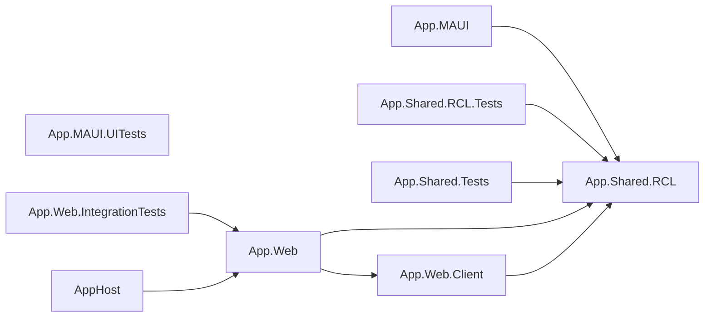
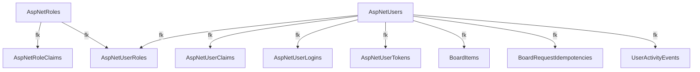

# Habitinator

<div align="center">


[](https://github.com/tothKarolyDavid/Habitinator/releases/latest)

A cross-platform productivity app built with .NET MAUI and Blazor. Manage habits, dailies, and to-dos with a focus timer, analytics, and reliable sync across web and mobile.

**Live Demo:** [habitinator.app](https://habitinator.app)

[Demo](https://habitinator.app) • [Preview](#preview) • [Download](#download--install) • [Features](#key-features) • [Tech Stack](#technology-stack) • [Getting Started](#getting-started)

</div>

---

## Preview
<div align="center">

<picture>
  <source media="(prefers-color-scheme: dark)"  srcset="docs/automation/demo-video-dark.gif">
  <source media="(prefers-color-scheme: light)" srcset="docs/automation/demo-video-light.gif">
  
</picture>

</div>

---

## Download & Install

### Available builds

**Live Demo (Web):** [https://habitinator.app](https://habitinator.app)  
**Latest Release:** [](https://github.com/tothKarolyDavid/Habitinator/releases/latest)

| Platform | Package | Notes |
|----------|---------|-------|
| Android | [Habitinator-android.apk](https://github.com/tothKarolyDavid/Habitinator/releases/latest/download/Habitinator-android.apk) | Install on-device (unknown sources required) |
| Windows | [Habitinator-windows-x64.zip](https://github.com/tothKarolyDavid/Habitinator/releases/latest/download/Habitinator-windows-x64.zip) | Portable app, extract and run |
| iOS / macOS | *Source only* | Build from source using .NET MAUI workload |

**Windows runtime note:** if your release is framework-dependent, install [.NET Desktop Runtime](https://dotnet.microsoft.com/download/dotnet/10.0) once.

#### Option 1: Use prebuilt release assets (recommended)

1. Open [latest releases](https://github.com/tothKarolyDavid/Habitinator/releases/latest)
2. Download your platform package
3. Follow platform steps below

#### Option 2: Build locally with .NET SDK

```powershell
# Windows
dotnet build -t:Run -f net10.0-windows10.0.19041.0

# Android (requires Android SDK)
dotnet build -t:Run -f net10.0-android
```

### Installation instructions

#### Android

1. Enable Install from unknown sources in system settings
2. Transfer the APK to your phone
3. Open the APK and install

#### Windows

1. Extract the ZIP file
2. Run `Habitinator.exe`
3. If prompted, install .NET Desktop Runtime

---

## Key Features

- **Core Planner**: Track habits, dailies, and to-dos. Organize them with tags, notes, and checklists.
- **Global Session Timer**: A stopwatch with target logging to trace time spent on specific items.
- **Statistics & Heatmap**: Interactive heatmap dashboard to monitor your progress over time.
- **Local-First & Sync**: The mobile/desktop clients run on SQLite for offline support and sync changes automatically to a server-side PostgreSQL backend.

---

## Technology Stack

| Layer | Technologies |
|-------|--------------|
| **Runtime** | .NET 10 |
| **Web UI** | Blazor Web App (Interactive Server), MudBlazor |
| **Native Apps** | .NET MAUI + Blazor Hybrid (Android, iOS, macOS, Windows) |
| **Database (Server)** | Neon Serverless PostgreSQL / any PostgreSQL via EF Core |
| **Database (Client)** | SQLite via EF Core |
| **Orchestration** | .NET Aspire AppHost |

---

## Getting Started

### Prerequisites
Make sure you have Docker installed and running for the local PostgreSQL container.

### Run & Debug (via Aspire)
Run the following command to start PostgreSQL, the web backend, and the native client host environment:
```powershell
dotnet run --project src/AppHost/AppHost.csproj
```

### Seeded Demo User
The application will automatically seed a guest account on startup:
- **Email:** `guest@habitinator.local`
- **Password:** `Guest123!`

---

## Architecture & Database

Here are the project dependencies and database schema (auto-updated via documentation scripts):

### Solution Graph
<!-- HABITINATOR_MERMAID_BEGIN:solution-graph -->

<!-- HABITINATOR_MERMAID_END:solution-graph -->

### Database Schema
<!-- HABITINATOR_MERMAID_BEGIN:database-schema -->

<!-- HABITINATOR_MERMAID_END:database-schema -->
